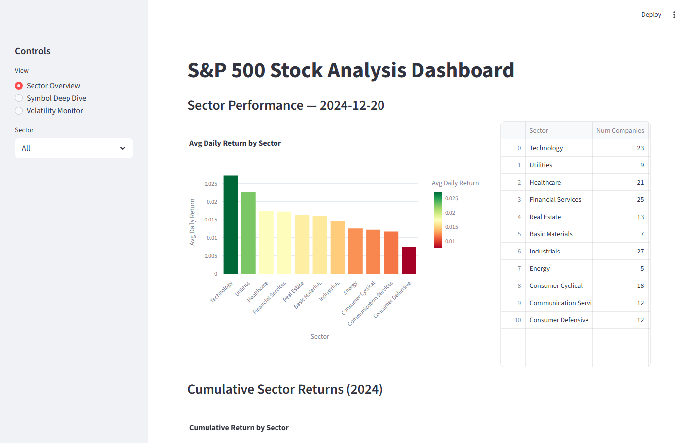
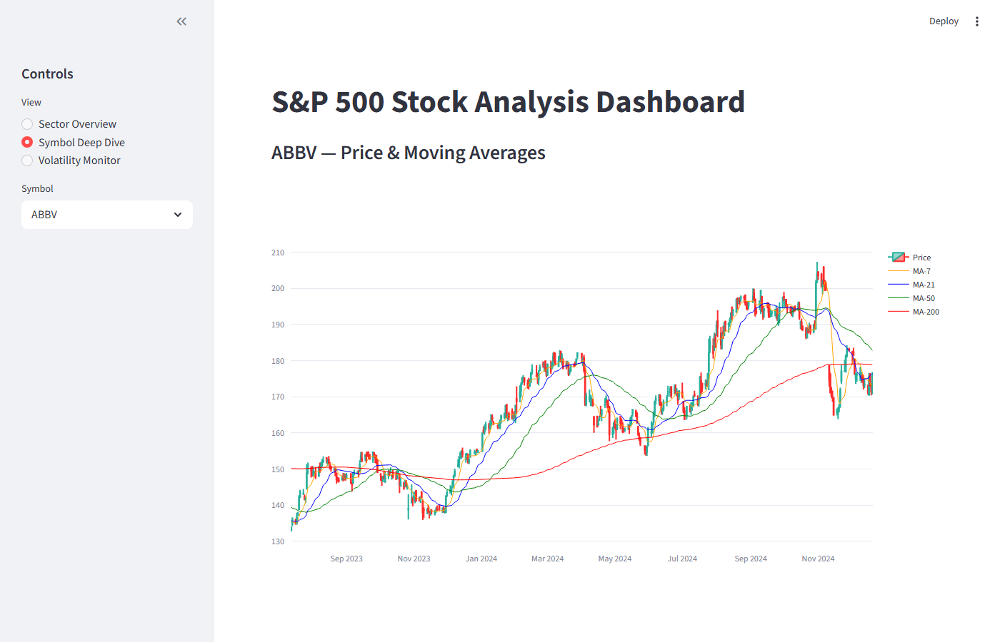
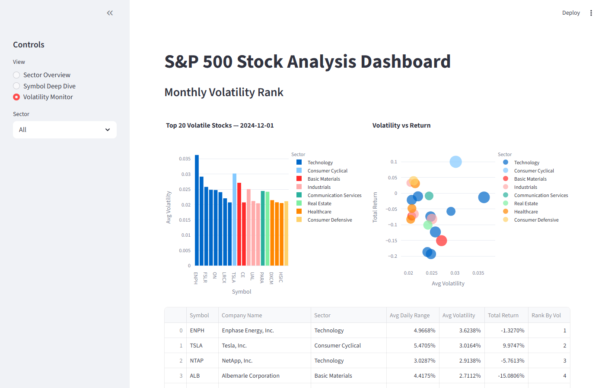

# S&P 500 Stock Market Technical Analysis

End-to-end data engineering pipeline that processes S&P 500 stock data from raw ingestion through cleaning, enrichment, and aggregation, surfaced via an interactive dashboard.
Goal: Create a dashboard for Short-Term Trading Analysis focusing on Price Trends, Volume, Chart Patterns and Moving Avergaes.

## Architecture

```
bronze.stocks ──► silver.stocks ──► gold.daily_summary ──► Streamlit Dashboard
bronze.companies ──► silver.companies ──► gold.sector_performance
bronze.index ──► silver.index ──► gold.moving_crossovers
                                ──► gold.monthly_volatility
```

## Tech Stack

| Layer | Tool |
|-------|------|
| Database | PostgreSQL 18 |
| Transformations | Raw SQL |
| Backfill | Python (psycopg2) |
| Orchestration | Apache Airflow (Docker) |
| Dashboard | Streamlit + Plotly |

## Project Structure

```
├── dags/stock_pipeline.py              # Airflow DAG
├── sql/
│   ├── silver/                         # Cleaning & enrichment (3 files)
│   ├── gold/                           # Aggregation & KPIs (4 files)
│   ├── tests/quality_checks.sql        # Data validation
│   └── dashboards/metabase_queries.sql # Example SQL queries
├── scripts/backfill.py                 # One-time backfill
├── dashboard.py                        # Streamlit app
├── docker-compose.yml                  # Airflow + Metabase
└── requirements.txt
```


## Dashboard Views

### Sector Overview

Daily returns by sector, cumulative trends, top/bottom gainers/losers.

### Symbol Deep Dive

Interactive OHLC candlestick with 4 moving average overlays (7/21/50/200-day), volume bars, and crossover signals.

### Volatility Monitor

Monthly volatility rankings with volatility-vs-return scatter plot.

## Data

- 1.89M raw rows, ~618K after cleaning (172 of 502 S&P 500 symbols with price data)
- Date range: 2010-01-04 to 2024-12-20
- Gold layer includes: daily moving averages (7/21/50/200), sector aggregates, golden/death cross signals, monthly volatility rankings
